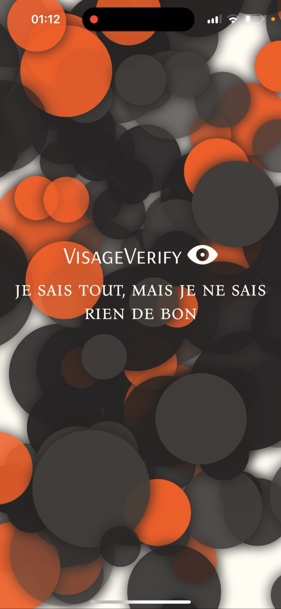

# VisageVerify

## Table of Contents

- [About](#about)
- [Features](#features)
- [Screenshots](#screenshots)
- [Animation Showcase](#animation-showcase)
  - [GIF Demo](#gif-demo)
- [Contact](#contact)

## About

VisageVerify is a mobile application built with SwiftUI, a passion project that combines original handmade designs, animations, facial recognition technology, QR code integration, and more.

## Features

- **Experimental interactive interface:** interesting and mesmerizing design.
- **Face recognition:** You don't have to store all those passwords and logins, the only thing you need is your face!
- **Customizable Themes:** Personalize the app to suit your style.

## Screenshots

  

 

<table align="center">
  <tr>
    <td></td>
    <td style="padding: 0 100px;"></td>
    <td></td>
  </tr>
  <tr>
    <td></td>
    <td></td>
    <td></td>
  </tr>
</table>

## Animation Showcase

### GIF Demo

**Note:** The GIFs below do not represent the actual animation speed.

 

Some of the animations are showcased in my two other side-projects:

https://github.com/kwuh91/Animated-SwiftUI-EyeBlinking

https://github.com/kwuh91/Animated-SwiftUI-Background

## Contact

Nikita - [@Kw_uh](https://t.me/Kw_uh) - nkt.ochkin@gmail.com

Project Link: [https://github.com/kwuh91/VisageVerify](https://github.com/kwuh91/VisageVerify)
